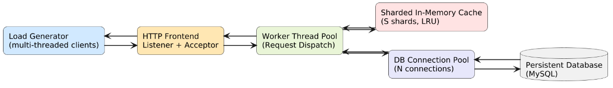

# CS744 Project: HTTP-based Key-Value Store

**Author:** Jayasri PA \
**Roll Number:** 25D0361 \
**Email:** [25d0361@iitb.ac.in](mailto:25d0361@iitb.ac.in)

---

## 1. Project Overview

This project implements a **multi-threaded, HTTP-based Key-Value Store** in C++.
The system supports `GET`, `PUT`, and `DELETE` operations over HTTP, with a **thread-safe LRU cache** for fast access and a **MySQL backend** for persistence.
A separate multi-threaded **client** program acts as a load generator to evaluate system performance under different workloads.

---

## 2. Directory Structure

```
decs-project/
├── src/
│   ├── client/
│   │   └── client.cpp
│   ├── server/
│   │   ├── server.cpp
│   │   └── db.cpp
│   └── include/
│       ├── httplib.h
│       └── db.hpp
├── build/
├── Makefile
├── .gitignore
└── README.md

```

---

## 3. System Requirements

| Component            | Version / Tool               |
| -------------------- | ---------------------------- |
| **Operating System** | Ubuntu 24.04 LTS             |
| **Compiler**         | g++ 13.3.0 or higher         |
| **MySQL Server**     | 8.0.43                       |
| **Libraries Used**   | `cpp-httplib`, `mysqlclient` |

### MySQL Setup

Run the following commands to configure the database:

```sql
CREATE DATABASE cs744_project;
CREATE TABLE kv_store (id VARCHAR(255) PRIMARY KEY, val TEXT);
CREATE USER 'cs744_user'@'localhost' IDENTIFIED BY '123';
GRANT ALL PRIVILEGES ON cs744_project.* TO 'cs744_user'@'localhost';
FLUSH PRIVILEGES;
EXIT;
```

---

## 4. Build Instructions

1. Clone the repository:

   ```bash
   git clone https://github.com/jayasri-pa/CS744-Project.git
   ```
2. Move into the project directory:

   ```bash
   cd CS744-Project
   ```
3. Build both client and server:

   ```bash
   make
   ```
4. The binaries will be located in the `build/` folder:

   ```
   build/server
   build/client
   ```

---

## 5. System Architecture



> The KV store has a client, a cache, and a database connected through an HTTP server.

**Flow:**

1. The **client** sends HTTP requests to the **server**.
2. The **server** checks the **cache** first for GETs.
3. On cache miss → fetches from **MySQL** and updates the cache.
4. **PUT** and **DELETE** operations modify both cache and database.

---

## 6. Workload Types

| Type            | Description                                   | Typical Bottleneck |
| --------------- | --------------------------------------------- | ------------------ |
| **PUT_ALL**     | Only PUT requests. Used to fill the database. | Disk / Database    |
| **GET_ALL**     | Reads many unique keys (few cache hits).      | Database           |
| **GET_POPULAR** | Repeats requests for a few hot keys.          | Cache / CPU        |
| **MIXED**       | Mix of GET and PUT with configurable ratios.  | Mixed load         |

---

## 7. Client Usage

### Command Format

```bash
./client <server_ip> <port> run <num_threads> <duration_sec> <workload_type> [key_space_params] [mixed_ratio_params] [options]
```

### Parameters

| Workload Type | Key Space Parameters | Mixed Ratio Parameters | Example Command |
| :--- | :--- | :--- | :--- |
| **`PUT_ALL`** | None | None | `./client 127.0.0.1 8080 run 32 30 PUT_ALL` |
| **`GET_ALL`** | `<num_put_threads> <max_keys_per_put_thread>` | None | `./client 127.0.0.1 8080 run 32 60 GET_ALL 4 1000` |
| **`GET_POPULAR`** | `<num_put_threads> <max_keys_per_put_thread>` | None | `./client 127.0.0.1 8080 run 32 60 GET_POPULAR` |
| **`MIXED`** | `<num_put_threads> <max_keys_per_put_thread>` | `<get_ratio> <put_ratio>` | `./client 127.0.0.1 8080 run 64 120 MIXED 4 1000 3 1` |
---

## 8. Manual Testing using curl

### Correct way to test `POST` and `GET`

```bash
# Insert a key-value pair
curl -X POST -d "key=key1&val=value1" http://127.0.0.1:8080/kv

# Retrieve the key
curl -X GET http://127.0.0.1:8080/kv/key1

# Delete the key
curl -X DELETE http://127.0.0.1:8080/kv/key1
```

> **Note:** In cpp-httplib, POST parameters are parsed from the request body, not the query string.
> Hence, using `-d "key=key1&val=value1"` ensures the server correctly receives the parameters.

---


---

## 8. Example Output
```
Server: 127.0.0.1:8080
Threads: 512, Duration: 300s (+ warmup 5s)
Workload: GET_POPULAR
Using deterministic seed: 42
----------------------------------------
----------------------------------------
Load Test Complete
----------------------------------------
{
  "server": "127.0.0.1:8080",
  "threads": 512,
  "duration_sec": 300,
  "warmup_sec": 5,
  "workload": "GET_POPULAR",
  "num_put_threads": 4,
  "max_keys_per_put_thread": 10000,
  "total_success": 113428,
  "total_errors": 0,
  "total_not_found": 0,
  "cache_hits": 95249,
  "cache_misses": 18179,
  "throughput_req_per_sec": 378.093,
  "avg_latency_ms": 1376.822,
  "p50_ms": 41.010,
  "p95_ms": 42.098,
  "p99_ms": 65903.025,
  "csv_path": ""
}
```
---


## 10. References

* cpp-httplib: [https://github.com/yhirose/cpp-httplib](https://github.com/yhirose/cpp-httplib)
* MySQL C API: [https://dev.mysql.com/downloads/c-api/](https://dev.mysql.com/downloads/c-api/)
* CS744 Course Project (Fall 2025)
